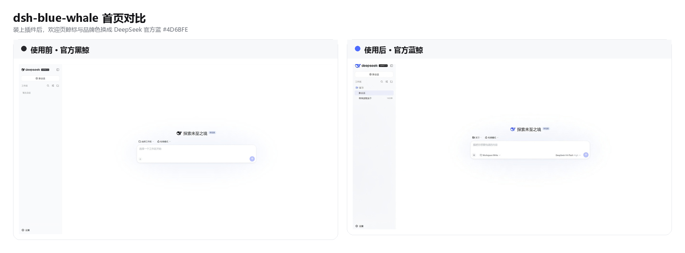
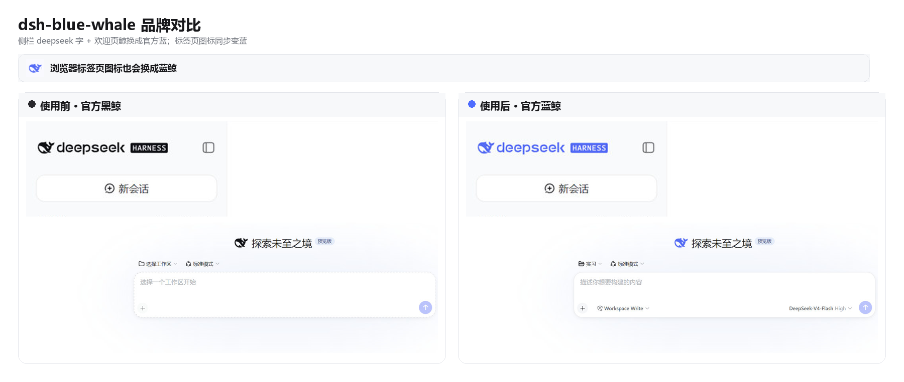

# dsh-blue-whale

English · [中文](README.zh.md)

A DeepSeek Chat-style blue-whale color skin. Light and dark follow the built-in appearance.





DSH ships as a black whale. [chat.deepseek.com](https://chat.deepseek.com) is a blue one. This plugin puts Chat blue `#4D6BFE` on the wordmark, hero fish, tab favicon, and primary actions. Light / dark / follow-system stay on the built-in Appearance setting.

## Install

```sh
dsh plugin --profile web add github:starslittle/dsh-blue-whale
```

Restart `dsh web`, then hard-refresh the browser (Ctrl+Shift+R). The skin is **on by default**.

Open **Settings → General → Blue Whale**. A green dot means it is on. **Turn off** matches the stock capsule control; **Turn on** is the blue fill.

## Check that it loaded

| What you see | What to do |
|---|---|
| Sidebar whale and `deepseek` letters are blue | It is on |
| Still the black whale | Restart, then hard-refresh |
| Turning the switch off restores the stock colors | Expected |

## What it changes

| | Stock DSH | This skin |
|---|---|---|
| Sidebar whale + `deepseek` | near-black / near-white | `#4D6BFE` |
| Hero whale | same | `#4D6BFE` |
| Browser tab icon | black (white in OS dark) | `#4D6BFE` |
| Brand / send / accents | black or white | `#4D6BFE` |
| Page background | built-in light / dark | unchanged |
| Light / dark switch | built-in Appearance | still built-in |

Supporting colors come from DSH's own `--dsw-static-deepseek-*` scale.

## What it does not do

- It does not change layout or density
- It does not change a desktop shell's window or tray icon
- Headless and TUI profiles have nothing to paint

Turning it off or uninstalling restores the stock colors immediately.

## License

MIT
